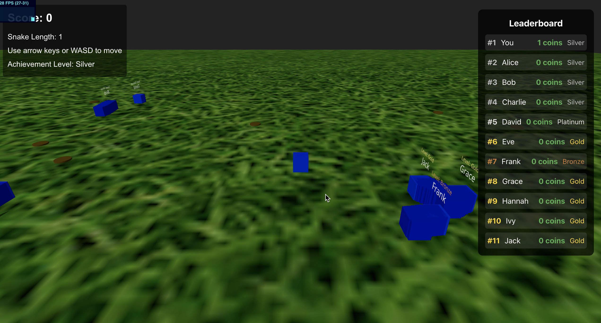

# User Achievements Aggregator Task

## Game demo

[game-demo-video.mov](./game-demo-video.mov)

## How to run solution

-   `dotnet run --project User.Achievements.API/User.Achievements.API.csproj` - this will start the API and open Swagger UI at `http://localhost:5041/swagger`.
-   In a separate terminal, from the project root directory, run `cd User.Achievements.Web`.
-   `npm install` - install dependencies.
-   `npm run dev` - this will start the frontend

## Required info to calculate account achievement level:

-   Get all users (need IDs).
-   Get games owned for each userId.
-   Calculate per game achievement %.
-   Iterate over games played and calculate achievement %
-   Per game, get available achievements from adjacent game object, get total completed achievements from root

### Achievement levels

| Level    | Description                                      |
| -------- | ------------------------------------------------ |
| Bronze   | owns > 10 games                                  |
| Silver   | owns >= 10 games and >= 75% achivements in each  |
| Gold     | owns >= 25 games and >= 80% achievements in each |
| Platinum | owns >= 50 games and 100% achievements in each   |

## Design decisions

-   `API > Models > Enums > AchievementLevel.cs` - have a base value `None = 0` due to the default value of Enums in CSharp being 0 - hence we don't want a default valid value. Also, user accounts don't necassarily have an achievement level, i.e. if less than 10 games owned.

-   `API > Services > UsersService > CalculateAchievementPercentage` - casting to float within the division to calculate average game achievement completion as the division will not always be integer. Then converting back to integer after multiplying by 100.

## Random ideas

1. Pagination/lazy loading/caching on the API, especially the collective `GetAll...` methods to improve performance.
2. Walking around game with three.js, some kind of coin collecting game in a house?
3. Unit tests for frontend - using Cucumber and Cypress?
